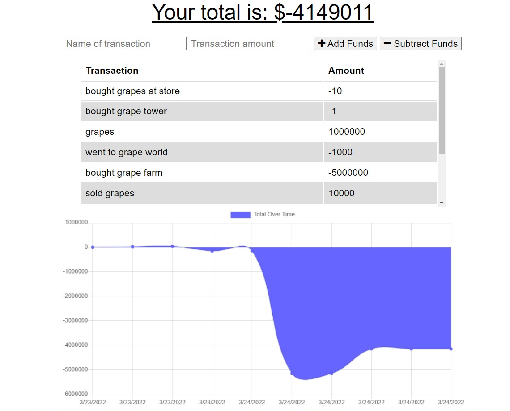

# Budget Tracker

## Questions
* GitHub User Name: [ryanweiler92](https://github.com/ryanweiler92)
* Repository Link: [Budget-Tracker](https://github.com/ryanweiler92/Budget-Tracker)
* Application Link: [Budget-Tracker](https://nameless-ravine-46317.herokuapp.com/)
* For any additional questions please reach out to ryanweiler92@gmail.com.

## Description
This application allows users to track transactions and expenses and show changes over time with the use of a graph. This application can be used offline as well. 

## Table of Contents
* [Installation](#installation)
* [Usage](#usage)
* [Contributors](#contributors)
* [Tests](#tests)
* [License](#license)

## Installation
No installation is required. 

## Usage

## Contributors
Ryan Weiler

## Tests 
No testing available at this time.

## License
  